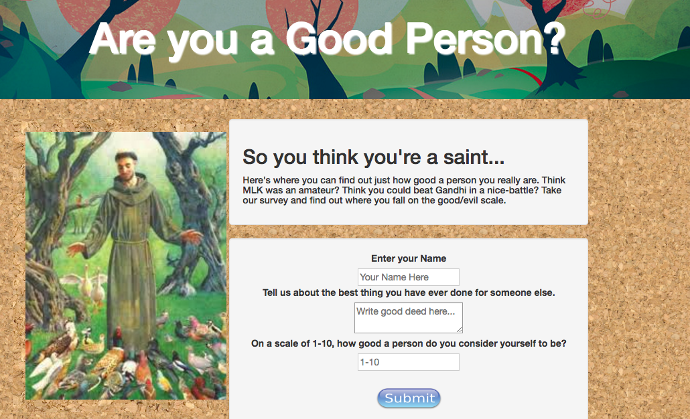
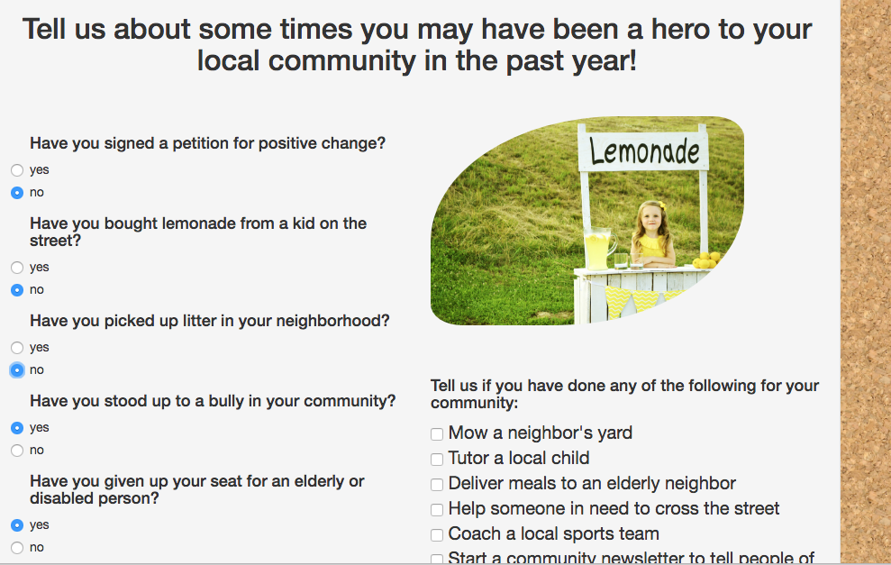
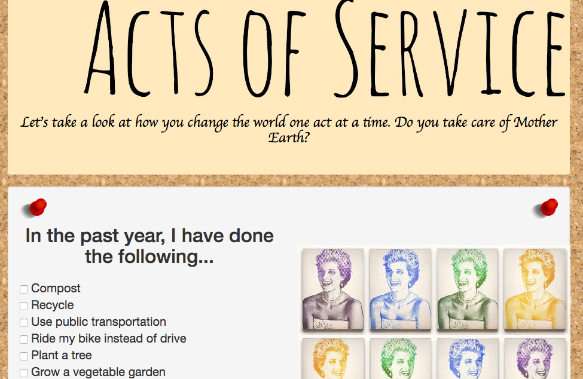
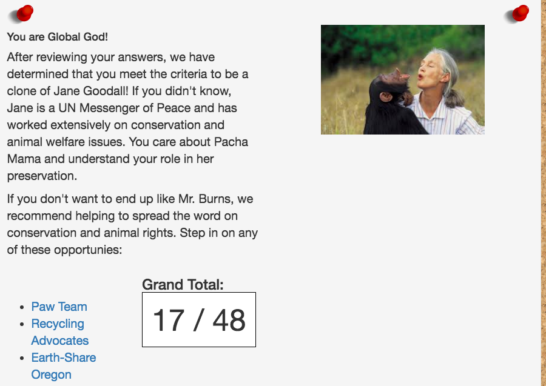

# Samaritan

##### _Survey on Community Service, June 22, 2017_

#### By Calla Rudolph, Larry Taylor, Dylan Lewis & Brittany Kerr

## Description

This web application allows users to take a survey about their community service activities over the past year. The program gives the user a score on a results page, which is used to match them to a celebrity good samaritan as well as suggest local organizations where they can continue to serve. The profile page lists a summary of all the good deeds the user has completed throughout the past year from the survey, as well as a to do list for the user to add tasks which they would like to complete. Clicking on the task moves it to the summary list. This is a practice in using object-oriented Javascript and is our first group project in Intro to Programming, Epicodus.

## Setup

Sign into GitHub and copy URL. In local terminal, type command "git clone [paste URL here]" To open this application in atom from local terminal, type "atom . " To open in browser, type "open index.html" into terminal.

## Preview

_Welcome Page requires an input to start and personalize the quiz._

_Users answer questions on four different forms. Checking boxes of activities they have engaged in over the past year._

_The forms are divided between areas of local and global good and that which is environment, humanitarian or animal focused._

_Users' scores land them on one of five result pages: Jane Goodall, Jaimie Foxx, Angelina Jolie, Mother Teresa or Dr Evil. Links to local organizations in the area of their good samaritan interests are provided on the page._

## Specifications

* User inputs their name and good deed and the page displays it back to them on their profile page.
  * Input: Name: 'Calla', Good Deed: 'walked a pony'
  * Output: 'Calla, you said you walked a pony.'
* User fills out multiple forms regarding experience in community service in past year and the selections are listed on the profile page in a summary.
  * Input: User selects 'donated clothing' and 'recycled' during survey.
  * Output: 'donated clothing' and 'recycled' appears on profile page in summary list.
* User submits all forms and receives a grand total.
  * Input: User fills out form and clicks submit.
  * Output: '36 points' appears on results screen.
* User's final score is categorized into a celebrity match based on form where their score is the highest.
  * Input: User scores 6 on form one, 3 on form two, 4 on form three and 1 on form four.
  * Output: Jamie Foxx (celebrity match from form one) appears on screen.
* User's selections throughout survey determine suggestion for future area of focus.
  * Input: User scores high on conservation (form two).
  * Output: Program recommends local parks and rec volunteer organization (suggestion match from form two).
* User is prompted to write in their goals and add them to a to do list on the profile page.
  * Input: User types 'adopt a cat' for goals.
  * Output: 'adopt a cat' is added to goals list.
* User is able to click on individual goals from to do list once completed and the goal will move to the summary list.
  * Input: User clicks 'adopt a cat' to mark it completed.
  * Output: 'adopt a cat' is moved from to do list to good deeds summary list.

## Technologies Used

Javascript, jquery-3, Bootstrap, CSS, HTML5

### License
This software is licensed under the MIT license.

Copyright &copy; 2017 **_Calla Rudolph, Larry Taylor, Dylan Lewis & Brittany Kerr_**
